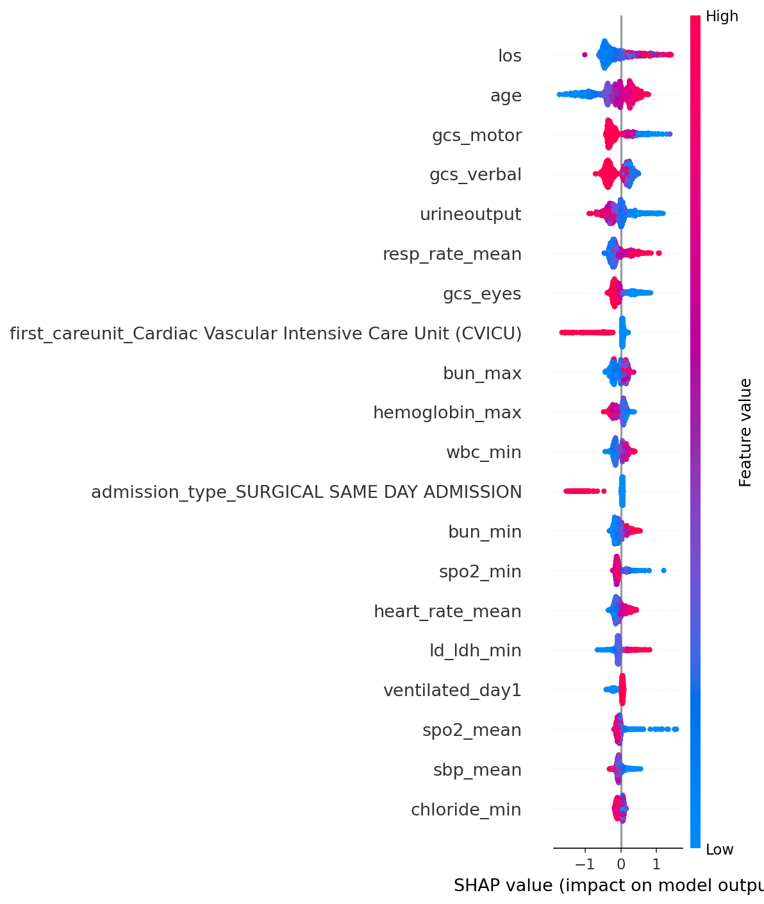

# MIMIC-IV ICU Mortality Prediction

A clinical machine learning pipeline for predicting in-hospital mortality of ICU patients using real-world MIMIC-IV data, built with XGBoost and SHAP.

## Dataset

[MIMIC-IV v3.1](https://physionet.org/content/mimiciv/) — a restricted-access clinical database containing 94,458 ICU stays at Beth Israel Deaconess Medical Center. Access requires PhysioNet credentialing and CITI human research training.

## Notebook

[View Notebook on nbviewer](#)

## Pipeline

- Features extracted via SQL on Google BigQuery, joining 8 clinical tables
- Dropped 32 features with >70% missing values
- Median imputation for numerical features, mode for categorical
- One-hot encoding for low cardinality categoricals, label encoding for race
- Class imbalance handling via scale_pos_weight (88% survived, 12% died)
- Removed SOFA composite scores to test raw feature predictiveness

## Models

### Logistic Regression (Baseline)

| Metric | Score |
|---|---|
| AUC-ROC | 0.888 |
| Died Recall | 79% |
| Died Precision | 37% |
| Macro F1 | 0.69 |

### XGBoost (No SOFA Scores)

| Metric | Score |
|---|---|
| AUC-ROC | 0.918 |
| Died Recall | 77% |
| Died Precision | 46% |
| Macro F1 | 0.75 |

## Key Finding

Removing SOFA composite organ failure scores did not degrade performance — the model achieved equivalent AUC-ROC (0.918) using only raw clinical measurements. Consistent with findings from the WiDS Datathon 2020 project, suggesting tree-based models independently learn organ failure patterns from raw vitals and labs.

## SHAP Analysis

SHAP values confirm the model learned clinically coherent patterns:

- Age — older patients have significantly higher mortality risk
- GCS components — low consciousness level strongly associated with mortality
- Urine output — low output indicates kidney failure
- Respiratory rate — elevated rate indicates respiratory distress
- Ventilation on day 1 — mechanical ventilation indicates severe illness
- Surgical same-day admission — strongest protective factor, planned procedures indicate healthier baseline

## Tech Stack

Python, XGBoost, scikit-learn, SHAP, pandas, Google BigQuery, SQL
